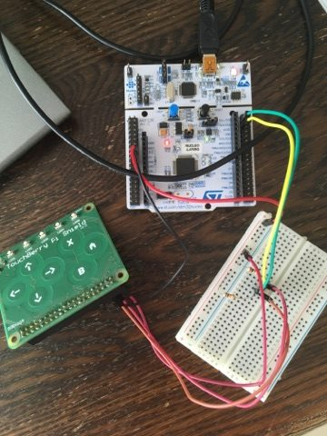

# Bug-controller

## Clone project
```shell
git clone git@github.com:vives-projectwerk2-2019/bug-controller.git
```
for the mbed functionality the following commands will be necessary in the work map of the project:
```shell
mbed new .
mbed deploy
```
## Requirements
1. mbed NUCLEO-L476RG
2. touchberry PI
3. LoRaWAN module

## Compile
```shell
mbed compile -m NUCLEO_L476RG -t GCC_ARM -f
```
## Function
Read pushing the capacitive buttons (QT1070).
Work with i2c, the read function will output an integer with which you can determine wich button was pushed. I used Putty to monitor which buttons were pressed.

Values that will be captured when certain buttons ar pressed:


## Image of the setup


## LoRaWAN shield
The LoRaWAN Shield, developed at VIVES. Is an Arduino compatible board that houses an RFM95W LoRaWAN transceiver and a small EEPROM. The shield can be used on every Mbed board that has an Arduino compatible header layout.

### Pin Mapping
The LoRaWAN Shield uses some fixed pins for SPI, together with some configurable DIP switchers at the bottom to configure different mapping. This feature is available to be compatible with different microcontroller boards and other sensor shields.

Signal | Pin | configurable
--- | --- | ---
MISO | D11 | no
MISO | D12 | no
CLK | D13 | no
NSS | D0 or A0 | yes, using DIP switch
RESET | D1 or A1 | yes, using DIP switch
DIO 0 | D2 or A2 | yes, using DIP switch
DIO 1 | D3 or AR | yes, using DIP switch

#### Pins DO and D1
Some microcontroller boards like ST Nucleo have hardwired serial connections for the USB UART on the pins D0 and D1. Therefore it is impossible to combine UART communications over USB and the LoRaWAN Shield using D0 and D1. Use the DIP switches to change the configuration and use A0 and A1.

## Dependencies

### Simple LoRaWAN library

Note: This library is still in development

[https://github.com/sillevl/mbed-Simple-LoRaWAN](https://github.com/sillevl/mbed-Simple-LoRaWAN)

### LoRaWAN Serialization library

Note: This library is still in development

[https://github.com/sillevl/mbed-lorawan-serialization](https://github.com/sillevl/mbed-lorawan-serialization)

# Prototype
First we've made a prototype. Herefor we've used 2 touchberry shields (1 for the direction and 1 for the action), a LoRaWAN shield to be able to communicate with the API, and a NUCLEO-L476RG board. In the prototype the EEPROM for the LoRa module was used to write and read the id. (Only 1 id was possible because every such EEPROM uses the same slaveaddress so the i2c-master doesn't know which slave it has to connect with), we also didn't have a i2c-switch available for the prototype therefore we could only use 1 EEPROM.

# Print
With the help of the insights we had during the making of the prototype, we made a PCB design for the controller. Also we made a design for the dongles with the EEPROM. The controller design has a i2c-switch in contrast to our prototype. 

## Functionality
Further we've updated the functionality of the capacitive touchbuttons. We've made them 'sticky' buttons so once you have inputted a value it will save this value till it is send via LoRa. This is implemented with the help of threads (multiple instance of the class button_thread run at the same time). In this thread we used a mutex to make sure there is mutual exclusion with the use of shared elements.

Furtermore there has been added a timer. Once a button (action or direction) is touched you have a certain amount of time to push the other button (direction or action) or to change your mind. Then both the direction and action will be transmitted via LoRa regardless if both action or direction option were pushed or not.
### Settings
For the threads to work you have to enable -std=gnu++11 . You can do this as following:
- go to : mbed-os/tools/profiles
- change -std=gnu++98 into -std=gnu++11 int the JSON files.

### Components:
For the print we used the following components:
- 1x STM32L476RGT6 processor
- 2x QT1070 (capacitive touch)
- 1x PCA9548 (i2c-switch)
- 1x MCP1825 (package: SOT-223-3) 
- 1x RFM95/96/97/98(W) - (LoRA)
- 4x 24xx64 5-Lead SOT-23 (EEPROM for dongle)

## Flash 
To flash the print you have to connect the right pins from the NUCLEO board to the controller:

Controller  | NUCLEO_L476RG
--- | ---
8: SWO | CN4: 6: SWO
7: UART_RX | CN3: RX
6: NRST | CN4: 5: NRST
5: UART_TX | CN3: TX 
4: TMS | CN4 : 4: SWDIO
3: 3.3V | 3.3V
2: TCK | CN4 : 2: SWCLK 
1: GND | GND

To flash an external device you have to remove the two jumpers from CN2.

### datasheet NUCLEO board
https://www.st.com/content/ccc/resource/technical/document/user_manual/98/2e/fa/4b/e0/82/43/b7/DM00105823.pdf/files/DM00105823.pdf/jcr:content/translations/en.DM00105823.pdf